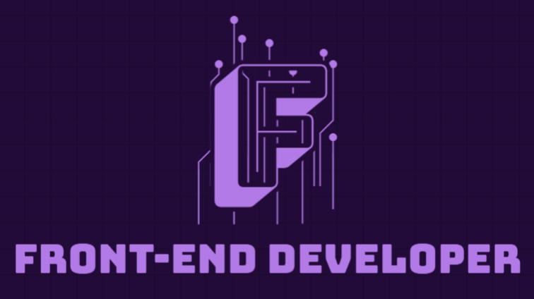

<!-- Heading Section Starts Here  -->

<p align="center">
  
</p>

<div align="center">
  
 [](https://git.io/typing-svg)
  
</div>

<div align="center">
  
## ` Welcome To My GitHub Profile `

</div>

### `A passionate Front-end Web Developer from Bangladesh. I'm also learning PERN Stack.`

### `I'm a student of Computer Science And Engineering.`

<!-- Heading Section Ends Here  -->

<!-- About me section starts here -->

#### 🚀 `About Me`

```node
I'm a frontend web developer specializing in visually stunning and
user-friendly interfaces. With expertise in HTML, CSS, BootStrap,
and JavaScript, I bring designs to life seamlessly across all devices
and browsers. My goal is to craft engaging digital experiences that
drive client success. Always updated on the latest web technologies,
I thrive in collaborative environments fostering creativity and
innovation. Let's build something amazing together.
```

<!-- About me section ends here -->

<!-- More Details Section Start Here  -->

#### `More Details:`

##### - 🔭I’m currently working on [Student of Computer Science and Engineering.](https://nwu.edu.bd/)

##### - 🌱I’m currently learning detpth of **`Front-end Development` React.js, JavaScript, TypeScript,Express.js, Web-Authentication And other backend Technology.**

##### -🤝I’m looking for help with **Helpless people.**

##### -👨‍💻All of my projects are available at [https://github.com/Fatema-Zahan-Shayla?tab=repositories](https://github.com/Fatema-Zahan-Shayla?tab=repositories)

##### -💬Ask me about **Web-development related question.**

##### -📫For any Query contact me **sajibbhattacharjee2000@gmail.com**

##### -📄Know about my experiences [https://sajib-bhattacharjee.github.io/CV-About-Myself/](https://sajib-bhattacharjee.github.io/CV-About-Myself/)

<!-- More Details Section Ends Here  -->

<!-- Skills Section Starts Here  -->

<div style="text-align:center; background-color: #0F0826; color: white;" >

### `Skills:`

### `Programming Language:`

<a href="https://www.cprogramming.com/" target="_blank" rel="noreferrer">  </a><a href="https://www.w3schools.com/cpp/" target="_blank" rel="noreferrer">  </a> <a href="https://developer.mozilla.org/en-US/docs/Web/JavaScript" target="_blank" rel="noreferrer">  </a>

### `Front-End(Web-Development):`

<a href="https://www.w3.org/html/" target="_blank" rel="noreferrer">  </a><a href="https://www.w3schools.com/css/" target="_blank" rel="noreferrer"> </a><a   href="https://getbootstrap.com" target="_blank" rel="noreferrer">  </a>

[](#)
[](#) [](#)
[](#)

</div>

<!-- Skills Section Ends Here  -->

<!-- Other Experiences Section Starts Here  -->

### `Others Experiences:`

    - GitHub
    - Micorsoft Word
    - Microsoft Powerpoint

<!-- Other Experiences Section Ends Here  -->

<!-- Education section start here  -->

### `Educational Info:`

    - B.Sc. in Computer Science & Engineering.
      North Western University.
      khulna,Bangladesh.
    - I.Sc.
      Bangladesh Navy School and College. Mongla,Bangladesh.
    - SSC
      Baintala Union High School. Rampal, Khulna.

<!-- Education section ends here  -->

<!-- languages section starts here  -->

### `Languages:`

    - 🇧🇩 Bangla: Native
    - 🏴󠁧󠁢󠁥󠁮󠁧󠁿 English: Intermediate

<!-- languages section ends here  -->

<!-- Sports and game section starts here  -->

### `What I like to do/Hobby:`

    - 🏸Badminton,♟️ Chess.
    - 🏊‍♂️Swimming,🏃‍♂️Running,🚶‍♂️ Walking.
    - ✈️Travelling.

<!-- Sports and games section ends here  -->

<!-- Contact Me section Starts here  -->
<div style="text-align: center; background-color: #0F0826;">

### `Contact Me:`

[](https://www.facebook.com/profile.php?id=61555177048552) [](https://www.linkedin.com/in/fatema-zahan-shayla-8b823b2ab/) [](mailto:fatemazahanshayla@gmail.com)

</div>
<!-- Contact Me section Ends here  -->

<!-- GitHub Most Uses Language Section Starts Here  -->
<div style="text-align: center; background-color: #0F0826;">

### `Most Usages Languages`

[](https://github.com/anuraghazra/github-readme-stats)

</div>

<!-- GitHub Most Uses Language Section Ends Here  -->

<!-- GitHub State Section Starts Here  -->

<div style="text-align: center; background-color: #0F0826;">

### `GitHub States:`


</div>

<!-- GitHub State Section Ends Here  -->

<!-- GitHub Matrix Section Starts Here  -->

<div style="text-align: center; background-color: #0F0826;">

### `GitHub Metrics:`


</div>

<!-- GitHub Matrix Section Ends Here  -->

<!-- GitHub Streak Section Starts Here  -->

<div style="text-align: center; background-color: #0F0826;">

### `GitHub Streak States:`


</div>

<!-- GitHub Streak Section Ends Here  -->

<!-- GitHub More Details Section Starts Here  -->
<div style="text-align: center; background-color: #0F0826;">

### `More Details:  `

<a href="https://github.com/Fatema-Zahan-Shayla"></a>

</div>
<!-- GitHub More Details Section Starts Here  -->

<!-- Profile View Section Starts Here  -->
<div style="text-align: center; background-color: #0F0826;">

### `GitHub Profile Views: `


</div>

<!-- Profile View Section Ends Here  -->

<!-- Dedication and Footer Section Starts Here -->

---

### `Created By` - _`Fatema Zahan Shayla`_

---

#### `All rights reserved by Fatema Zahan Shayla @2024`

<div style="text-align: center; background-color: #0F0826; padding: 10px">

### `Created By-->`

**&copy;`-Fatena Zahan Shayla`**

**`Dedicated for My Dear Respectable Sir! 💕"Anisul Islam"💕`**

> > > > ### Thanks A Lot For Visiting...!!!

</div>
  
</div>

<!-- Dedication and Footer Section Ends Here -->
